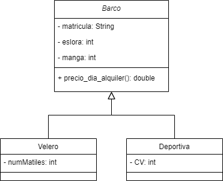

# Clases abstractas e Interfaces. Ejemplo 1: Alquilable

## Ejemplo00_Herencia

En el primer ejemplo se empieza repasando los coneptos de herencia y polimorfismo asimilados en temas anteriores. Para ello se implementa en código el siguiente diagrama de clases UML:

En este ejemplo las clases hijas (Velero y Deportiva) pueden (opcional) sobrescribir (override) el método precio_dia_alquiler, y modificar su comportamiento (polimorfismo).

## Ejemplo01_Abstracta

En este segundo ejemplo se requiere que todas las clases hijas de la clase madre Barco estén obligadas a implementar el método precio_dia_alquiler(). Para ello se hará uso de una clase abstracta (definiendo el método precio_dia_alquiler() como abstracto). Para ello se implementa en código el siguiente diagrama de clases UML:

En este ejemplo las clases hijas (Velero y Deportiva) están obligadas a sobrescribir el método precio_dia_alquiler.

## Ejemplo02_Interfaz

En este tercer ejemplo se requiere que no sólo se establezca la obligación de implementar el método precio_dia_alquiler() a todas las clases hijas de la clase madre Barco, sino que se requiere implementar este método también a la clase Pedalo, que no hereda de Barco (no es una clase hija). Para ello se hará uso de una interfaz. Esta estructura permite establecer la obligación de implementar métodos en clases sin la necesidad de que exista realación de herencia. Para ello se implementa en código el siguiente diagrama de clases UML:

Clase Barco: 
- Clase madre de Velero y Deportiva (relación de herencia). 
- Implementa la interfaz Alquilable (recibiendo el método abstracto precio_dia_alquiler())
- Clase abstracta (para obligar a las clases hijas a implementar los métodos abstractos).
