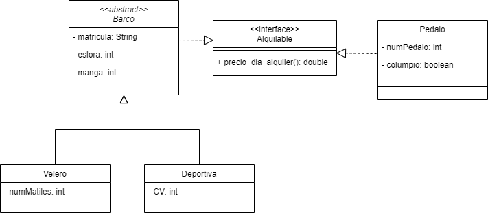

# Ejemplo 1 de Clases abstractas e interfaces: Alquilable

## Diagrama de clases UML

## Explicación del código

Clase Barco: 
- Clase madre de Velero y Deportiva (relación de herencia). 
- Implementa la interfaz Alquilable (recibiendo el método abstracto precio_dia_alquiler())
- Clase abstracta (para obligar a las clases hijas a implementar los métodos abstractos).
