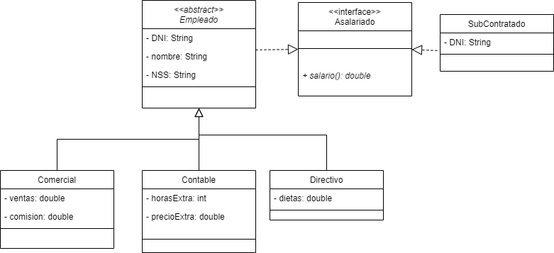

# Ejemplo 2 de Clases abstractas e interfaces: Asalariado

## Diagrama de clases UML

## Explicación del código

Clase Empleado: 
- Clase madre de Comercial, Contable y Directivo (relación de herencia). 
- Implementa la interfaz Asalariado (recibiendo el método abstracto salario())
- Clase abstracta (para obligar a las clases hijas a implementar los métodos abstractos).
