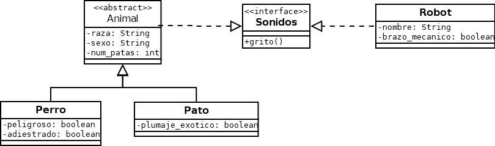

# Actividad 1 de Clases abstractas e Interfaces: Sonidos

## Ejercicio03: Clase abstracta
Se requiere desarrollar un proyecto con los siguientes requisitos:
- Implementar una clase llamada Animal con los siguientes parámetros: raza (cadena de texto), sexo (cadena de texto) y num_patas (entero).
- Implementar una clase llamada Perro con los siguientes parámetros: peligroso (booleana) y adiestrado (booleana).
- Implementar una clase llamada Pato con los siguientes parámetros: plumaje_exotico (booleana).

Las clases Perro y Pato serán clases “hijas” de la clase “madre” Animal. Esto implicará que ambas clases heredarán tanto los atributos como los métodos definidos en la clase “madre” Animal.

Se requiere que todas las clases hijas de la clase madre Animal estén obligadas a implementar un método llamado grito(), que devuelva una cadena de texto (String), y cada una de las clases “hijas” lo desarrolle de distinta forma. Por ejemplo, al ejecutar ese método los perros deben devolver la cadena de texto “¡Guau!” y los patos deben devolver “¡Cuac!”.

## Ejercicio04: Interfaz

Una vez finalizado el anterior ejercicio, se pide modificar el proyecto para incluir los siguientes requisitos:

- Implementar una clase Robot con los siguientes parámetros: nombre (cadena de texto), brazo_mecanico (booleana)

Se requiere que la obligación de implementar el método grito() no sea exclusivamente de las clases “hijas” que hereden de la clase “madre” Animales, sino que se requiera también su implementación en otras clases. Por ejemplo, la clase Robot también debe desarrollar ese método grito(), a pesar de no heredar de la clase Animal. Realiza las modificaciones necesarias para lograrlo.

Clase Animal: 
- Clase madre de Perro y Pato (relación de herencia). 
- Implementa la interfaz Sonidos (recibiendo el método abstracto grito())
- Clase abstracta (para obligar a las clases hijas a implementar los métodos abstractos).