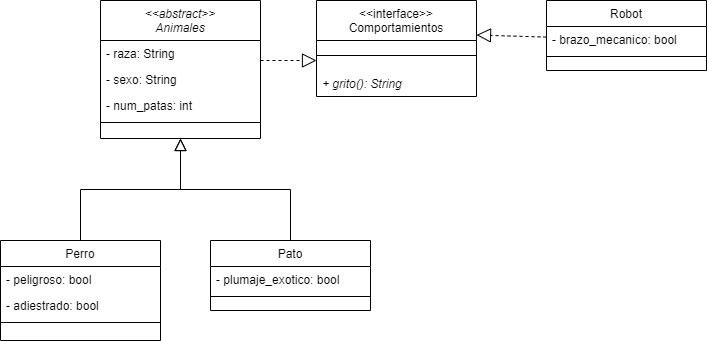

# Actividad 1 de Clases abstractas e interfaces: Sonidos

## Diagrama de clases UML

## Explicación del código

Clase Animal: 
- Clase madre de Perro y Pato (relación de herencia). 
- Implementa la interfaz Sonidos (recibiendo el método abstracto grito())
- Clase abstracta (para obligar a las clases hijas a implementar los métodos abstractos).